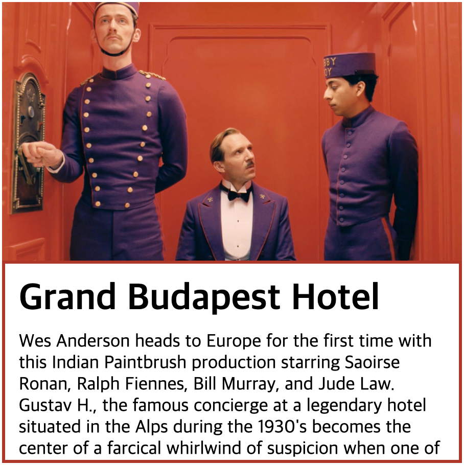

# 그랜드 부다페스트 호텔

깔끔한 영화 소개 모듈을 만들어 봅시다.

여러분은 `<div class="info">`에 네 가지만 해주시면 됩니다. 코드는 `css` 폴더에 `style.css`에 작성해주세요.

1. 세로 길이를 `220px`로 설정해주세요.
2. `3px` 두께에 색은 `#B72920`인 테두리를 입혀주세요.
3. 문구를 스크롤하면서 볼 수 있도록 `overflow` 속성을 설정해주세요.
4. 글이 테두리에 너무 붙어 있지 않도록 `15px`의 여유 공간을 주세요.
5. style.css 에 기본 설정 
```
* {
  box-sizing: border-box;
}
```

### 과제를 완료하면 다음과 같이 됩니다.



